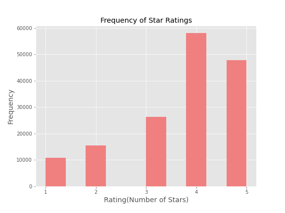

# Sentiment Analysis through Restaurant Ratings
Using Natural Language Processing to classifiy restaurant ratings 

## The Big Idea 
If restaurant ratings can be accurately classified by text, then businesses would be able to gain a deeper understanding of the customer experience, or more specifically, what customers want out of their experience. A simple star rating from 1-5 is helpful, however it only goes so far--we do not know what the customer liked or didn't like. With a system that can classify ratings through text, a business owner can collect information about, say, which words or sentiments their business is trying to illicit. Businesses can make use of sentiment analysis to gauge customer sentiment at large.

## Data and EDA 
The dataset I utilized was originally released by Yelp, and has more than 200,000 total entries of customer reviews of various businesses in Arizona. I specifically wanted to focus on restaurants; dining experieces can be hard to quantify as it is not just about the price of the meal, but also about customer service, atmosphere and ambiance. I wanted to explore the possible role machine learning can have in chasing down the elusive qualities of what makes a "good eat".

After filtering I was left with almost 160,000 restaurant reviews. Features include attributes like business name, address, user name, number of reviews left by the user and the number of reviews the business has. However, what I was really after were the bodies of text the reviewers left, and the number of stars(from 1 to 5) they rated the restaurant. 

After exploring, I noticed quite a class imbalance for the star ratings: 

I decided to consolidate my classes to three: 1 = Bad Review, 2 = Neutral, 3 = Good Review. I grouped together 1-2 stars to class 1, 3 stars to class 2, and 4-5 stars to class 3. Still; there is a class imbalance, but that can be addressed when modeling.

Next I defined a (Pythonic) class to handle both cleaning (removing stopwords and/or non-alphabetic characters) and vectorizing the 'text' column of the dataframe. This class is defined in 'text_pipeline.py' and can be found in the src folder of this repo.

## Modeling and Results 
I began with a baseline of random choice(if each class had equal probability of being predicted). Then, since I had such a class imbalance, and I wanted to avoid strictly predicting the majority class, I decided to undersample the majority class so that all the classes would be evenly distributed for my training sets, but did not perform undersampling for the testing sets. However, this undersampling method resulted in some evident overfitting in Logistic Regression, Random Forest and Gradient Boosting models, which can be seen below. 

## Next Steps / Future Discussion 
Placeholder for next steps / application and deployment. 
